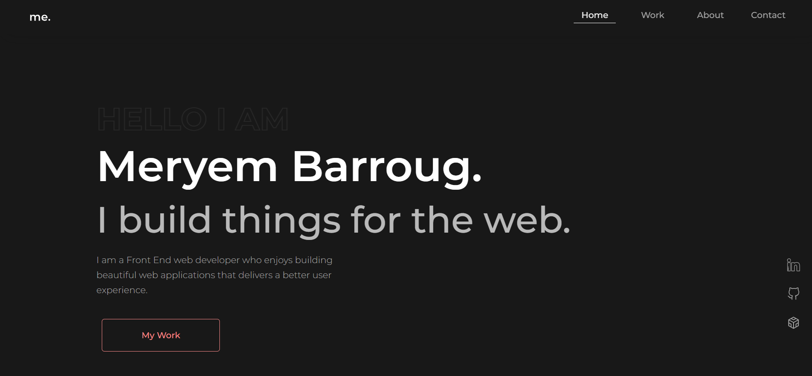

<!-- AUTO-GENERATED-CONTENT:START (STARTER) -->
<p align="center">
  <a href="https://meryembarroug.netlify.app/">
    
  </a>
</p>
<h1 align="center">
 Meryem Barroug Portfolio
</h1>
<p align="center">
Welcome to my personal website built with ❤️ using Gatsby and hosted on Netlify.
</p>

## 💫 Deploy

</br>

<center>⬇️ You can find a live version ⬇️.</br>

[](https://meryembarroug.netlify.app/)

</center>

## 🚀 Quick start

1.  **Clone this repo**

1.  **Install Gatsby CLI.**

    ```shell
    npm install -g gatsby-cli
    ```

1.  **Install dependencies**

    ```shell
    npm install

    ```

1.  **Start the development server**

    ```shell
    gatsby develop
    ```

## 🎓 Learning Gatsby

If you still Looking for more information about Gatsby look through their links below.

Full documentation for Gatsby lives [on the website](https://www.gatsbyjs.com/). Here are some places to start:

- **For most developers, we recommend starting with our [in-depth tutorial for creating a site with Gatsby](https://www.gatsbyjs.com/tutorial/).** It starts with zero assumptions about your level of ability and walks through every step of the process.

- **To dive straight into code samples, head [to our documentation](https://www.gatsbyjs.com/docs/).** In particular, check out the _Guides_, _API Reference_, and _Advanced Tutorials_ sections in the sidebar.

<!-- AUTO-GENERATED-CONTENT:END -->
